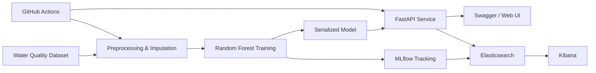

# Water Quality MLOps Pipeline

An end-to-end machine learning system for predicting water potability, exposing predictions through a FastAPI service, tracking experiments with MLflow, packaging the application with Docker, and forwarding operational metrics to Elasticsearch/Kibana.

## Highlights

- Reproducible preprocessing and Random Forest training pipeline
- MLflow experiment tracking for parameters, metrics and model artifacts
- FastAPI prediction, health-check and model-retraining endpoints
- Interactive OpenAPI/Swagger documentation
- Docker and Docker Compose deployment
- Elasticsearch, Kibana and Filebeat monitoring stack
- Automated code-quality, security and test checks with GitHub Actions

## Architecture



## API demonstration

### Prediction endpoint


### Model retraining endpoint


### Docker image


## Project structure

```text
.
├── .github/workflows/ci.yml
├── assets/screenshots/
├── data/water_potability.csv
├── src/water_quality/
│   ├── api.py
│   ├── cli.py
│   ├── config.py
│   ├── monitoring.py
│   └── pipeline.py
├── tests/
├── web/index.html
├── Dockerfile
├── docker-compose.yml
├── Makefile
└── requirements.txt
```

## Run locally

```bash
python -m venv .venv
source .venv/bin/activate       # Windows PowerShell: .venv\Scripts\Activate.ps1
pip install -r requirements.txt
make train
make api
```

Open:

- API documentation: `http://localhost:8000/docs`
- Web interface: `http://localhost:8000/ui`
- Health endpoint: `http://localhost:8000/health`

## Run with Docker

```bash
docker compose up --build
```

Services:

| Service | URL |
|---|---|
| FastAPI / Swagger | `http://localhost:8000/docs` |
| Kibana | `http://localhost:5601` |
| Elasticsearch | `http://localhost:9200` |

The API starts without a model on a clean installation. Call `POST /retrain` once to train and persist the model, then use `POST /predict`.

## Example request

```json
{
  "ph": 7.0,
  "Hardness": 180,
  "Solids": 20000,
  "Chloramines": 7,
  "Sulfate": 330,
  "Conductivity": 420,
  "Organic_carbon": 14,
  "Trihalomethanes": 65,
  "Turbidity": 4
}
```

## Tests and quality checks

```bash
make format
make lint
make security
make test
```

## Important note

This repository is an educational machine learning project. Its predictions must not be used as a substitute for certified laboratory testing or public-health guidance.

## Author

**Sarah Faleh** — Final-year Software Engineering student specializing in Data Science and Artificial Intelligence.
