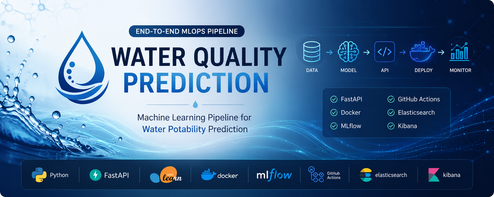
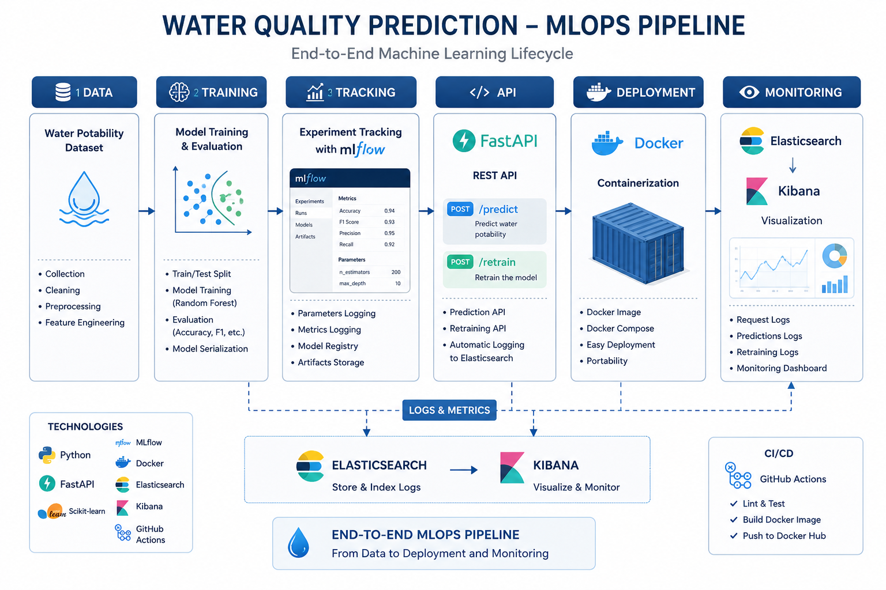
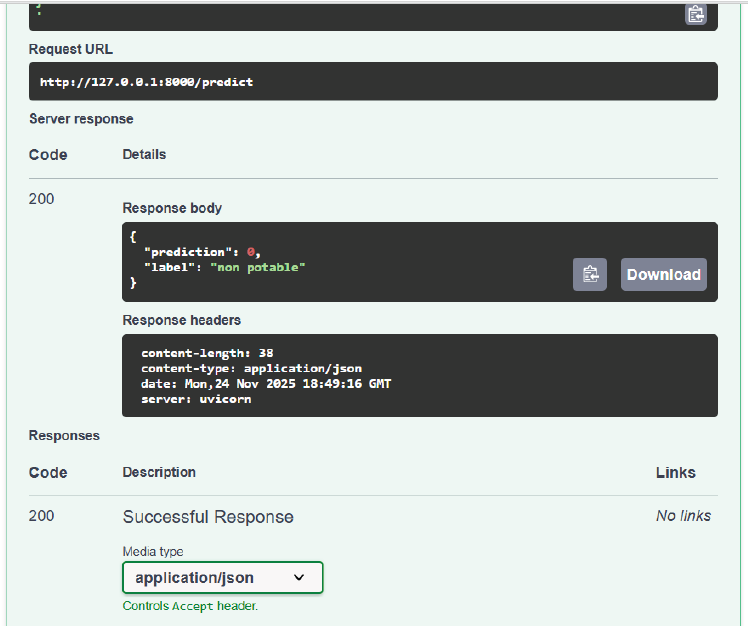
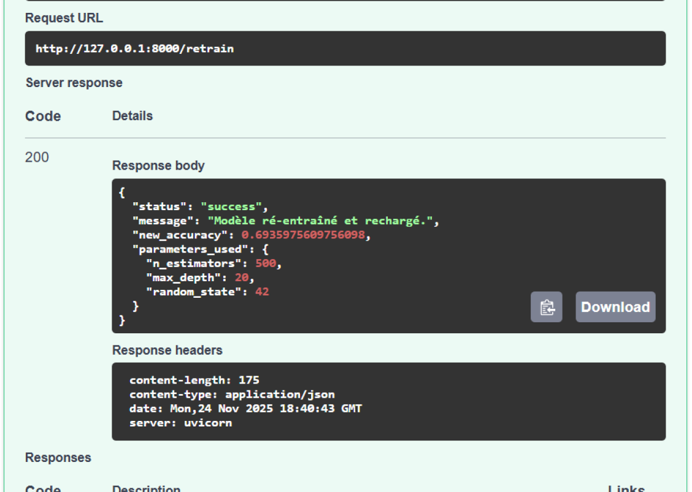
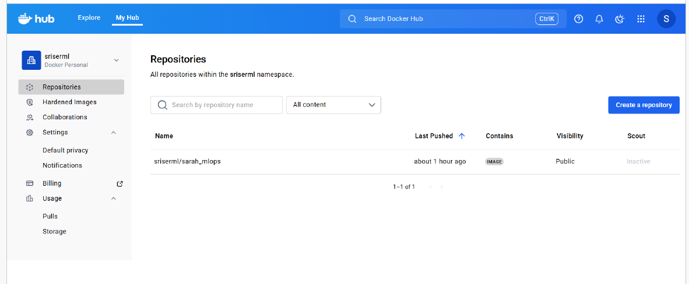

<p align="center">
  
</p>

<h1 align="center">
  Water Quality Prediction — End-to-End MLOps Pipeline
</h1>

<p align="center">
  A production-oriented machine learning project covering training,
  experiment tracking, API serving, containerization, continuous integration,
  logging, and monitoring.
</p>

<p align="center">
  
  
  
  
  
  
  
</p>

<p align="center">
  <a href="https://github.com/sarah-falehh/water-quality-prediction-mlops/actions/workflows/mlops-ci.yml">
    
  </a>
</p>

---

## Overview

This repository demonstrates an end-to-end **Machine Learning Operations
(MLOps)** workflow for predicting whether water is potable from its
physicochemical properties.

The project goes beyond model training and covers the broader lifecycle of a
machine learning application:

- Data loading and preprocessing
- Feature preparation
- Model training and evaluation
- Experiment tracking with MLflow
- Model serving through a FastAPI REST API
- Interactive API documentation with Swagger/OpenAPI
- Containerization with Docker and Docker Compose
- Continuous integration with GitHub Actions
- Application logging with Elasticsearch and Kibana
- Model retraining through an API endpoint

The codebase follows a modular structure so that the training, inference,
monitoring, configuration, and API components can be maintained independently.

---

## Key Features

- Reproducible machine learning training pipeline
- Binary classification of potable and non-potable water
- FastAPI inference service
- Interactive Swagger/OpenAPI documentation
- Dedicated prediction and model-retraining endpoints
- MLflow parameter, metric, and artifact tracking
- Dockerized application environment
- Multi-service orchestration with Docker Compose
- Automated formatting, linting, and testing through GitHub Actions
- Structured application and prediction logging
- Elasticsearch log indexing
- Kibana log visualization
- Automated tests for the API and ML pipeline
- Modular Python package under `src/water_quality`

---

## Architecture

The following diagram presents the main components and data flow of the
application.

<p align="center">
  
</p>

### High-level workflow

```text
Water Potability Dataset
           │
           ▼
Data Loading and Validation
           │
           ▼
Cleaning and Missing-Value Handling
           │
           ▼
Feature Preparation
           │
           ▼
Train/Test Split
           │
           ▼
Random Forest Training
           │
           ├──────────────► MLflow Tracking
           │                  ├── Parameters
           │                  ├── Metrics
           │                  └── Artifacts
           ▼
Model Evaluation
           │
           ▼
Model Serialization
           │
           ▼
FastAPI REST Service
           │
           ├── /predict
           ├── /retrain
           └── /docs
           │
           ▼
Docker Deployment
           │
           ▼
Elasticsearch and Kibana Monitoring
```

---

## Technology Stack

| Category | Technologies |
|---|---|
| Programming language | Python 3.11 |
| Data processing | Pandas, NumPy |
| Machine learning | Scikit-learn, Random Forest |
| Model evaluation | Accuracy, precision, recall, F1-score |
| API development | FastAPI, Uvicorn |
| API documentation | Swagger UI, OpenAPI |
| Experiment tracking | MLflow |
| Containerization | Docker, Docker Compose |
| Monitoring and logging | Elasticsearch, Kibana, Filebeat |
| Continuous integration | GitHub Actions |
| Testing | Pytest |
| Code quality | Black, Flake8, Bandit |
| Version control | Git, GitHub |

---

## Project Structure

```text
water-quality-prediction-mlops/
│
├── .github/
│   └── workflows/
│       └── mlops-ci.yml
│
├── assets/
│   ├── banner.png
│   └── screenshots/
│       ├── dockerhub-image.png
│       ├── swagger-predict.png
│       └── swagger-retrain.png
│
├── data/
│   └── water_potability.csv
│
├── docs/
│   └── architecture.png
│
├── src/
│   └── water_quality/
│       ├── __init__.py
│       ├── api.py
│       ├── cli.py
│       ├── config.py
│       ├── monitoring.py
│       └── pipeline.py
│
├── tests/
│   ├── test_api.py
│   └── test_pipeline.py
│
├── web/
│   └── index.html
│
├── .dockerignore
├── .gitignore
├── Dockerfile
├── LICENSE
├── Makefile
├── README.md
├── docker-compose.yml
├── filebeat.yml
└── requirements.txt
```

---

## Dataset

The project uses a water-potability dataset containing physicochemical
measurements associated with drinking-water quality.

### Main features

| Feature | Description |
|---|---|
| `ph` | Acid–base balance of the water |
| `Hardness` | Concentration of calcium and magnesium salts |
| `Solids` | Total dissolved solids |
| `Chloramines` | Chloramine concentration |
| `Sulfate` | Sulfate concentration |
| `Conductivity` | Electrical conductivity |
| `Organic_carbon` | Organic carbon concentration |
| `Trihalomethanes` | Trihalomethane concentration |
| `Turbidity` | Water clarity measurement |
| `Potability` | Target variable: potable or non-potable |

### Dataset information

| Property | Value |
|---|---:|
| Number of observations | `TO UPDATE` |
| Number of input features | 9 |
| Target classes | Potable / Non-potable |
| Missing values | Present in selected variables |
| Final model | Random Forest Classifier |

> Add the original dataset URL and its licensing information here before
> publishing the final release.

> **Disclaimer:** This project is intended for educational and demonstration
> purposes only. Its predictions must not replace certified laboratory
> water-quality testing or professional health and safety assessments.

---

## Model Training Pipeline

The training workflow performs the following steps:

1. Load the CSV dataset.
2. Validate the expected columns.
3. Handle missing values.
4. Separate input variables from the target.
5. Split the data into training and testing subsets.
6. Train a Random Forest classifier.
7. Evaluate the trained model.
8. Log parameters and metrics to MLflow.
9. Serialize the selected model for inference.
10. Expose the model through FastAPI.

---

## Model Performance

Replace the values below with the metrics generated by your final experiment.

| Metric | Score |
|---|---:|
| Accuracy | `TO UPDATE` |
| Precision | `TO UPDATE` |
| Recall | `TO UPDATE` |
| F1-score | `TO UPDATE` |

### Validation configuration

| Parameter | Value |
|---|---|
| Validation method | Train/test split |
| Test size | `TO UPDATE` |
| Random state | 42 |
| Final estimator | Random Forest Classifier |
| Number of estimators | `TO UPDATE` |
| Maximum depth | `TO UPDATE` |

Do not add estimated or invented results. Use the values from the final MLflow
run or from the evaluation output generated by the pipeline.

---

## API Endpoints

| Method | Endpoint | Description |
|---|---|---|
| `GET` | `/` | API information or service status |
| `GET` | `/health` | Health-check endpoint, if enabled |
| `POST` | `/predict` | Predict whether a water sample is potable |
| `POST` | `/retrain` | Retrain and reload the machine learning model |
| `GET` | `/docs` | Interactive Swagger documentation |
| `GET` | `/redoc` | ReDoc API documentation |

---

## Installation

### Prerequisites

Make sure the following tools are installed:

- Python 3.11 or later
- Git
- Docker and Docker Compose, for the containerized setup

### Clone the repository

```bash
git clone https://github.com/sarah-falehh/water-quality-prediction-mlops.git
cd water-quality-prediction-mlops
```

---

## Run Locally

### 1. Create a virtual environment

```bash
python -m venv .venv
```

### 2. Activate it on Windows

```powershell
.venv\Scripts\activate
```

### Activate it on Linux or macOS

```bash
source .venv/bin/activate
```

### 3. Install the dependencies

```bash
python -m pip install --upgrade pip
pip install -r requirements.txt
```

### 4. Start the FastAPI server

```bash
uvicorn water_quality.api:app --app-dir src --reload
```

The API will be available at:

```text
http://localhost:8000
```

Swagger documentation:

```text
http://localhost:8000/docs
```

ReDoc documentation:

```text
http://localhost:8000/redoc
```

---

## Run with Docker

Build and start the full application stack:

```bash
docker compose up --build
```

Run the services in the background:

```bash
docker compose up --build -d
```

View running containers:

```bash
docker compose ps
```

View service logs:

```bash
docker compose logs -f
```

Stop the application:

```bash
docker compose down
```

Remove containers and associated volumes:

```bash
docker compose down -v
```

Depending on the ports configured in `docker-compose.yml`, the services should
be accessible through addresses similar to:

| Service | Default address |
|---|---|
| FastAPI | `http://localhost:8000` |
| Swagger UI | `http://localhost:8000/docs` |
| MLflow | `http://localhost:5000` |
| Elasticsearch | `http://localhost:9200` |
| Kibana | `http://localhost:5601` |

Verify these values against the actual ports defined in your
`docker-compose.yml`.

---

## API Usage

### Prediction request

Check the exact field names and validation constraints in
`src/water_quality/api.py`.

Example request:

```bash
curl -X POST "http://localhost:8000/predict" \
  -H "Content-Type: application/json" \
  -d '{
    "ph": 7.1,
    "Hardness": 204.8,
    "Solids": 20791.3,
    "Chloramines": 7.3,
    "Sulfate": 368.5,
    "Conductivity": 564.3,
    "Organic_carbon": 10.3,
    "Trihalomethanes": 86.9,
    "Turbidity": 2.9
  }'
```

Example response:

```json
{
  "prediction": 0,
  "label": "non potable"
}
```

### Retraining request

Example:

```bash
curl -X POST "http://localhost:8000/retrain" \
  -H "Content-Type: application/json" \
  -d '{
    "n_estimators": 500,
    "max_depth": 20,
    "random_state": 42
  }'
```

Example response:

```json
{
  "status": "success",
  "message": "Model retrained and reloaded.",
  "new_accuracy": 0.69,
  "parameters_used": {
    "n_estimators": 500,
    "max_depth": 20,
    "random_state": 42
  }
}
```

---

## Screenshots

### Prediction Endpoint

The prediction endpoint returns the binary model output and a human-readable
water-potability label.

<p align="center">
  
</p>

---

### Model Retraining Endpoint

The retraining endpoint accepts model hyperparameters, runs the training
pipeline, reloads the model, and returns the updated evaluation result.

<p align="center">
  
</p>

---

### Docker Image

The application image can be built and distributed through Docker.

<p align="center">
  
</p>

---

## MLflow Experiment Tracking

MLflow is used to manage reproducibility and compare model experiments.

The pipeline can record:

- Training parameters
- Hyperparameter values
- Accuracy
- Precision
- Recall
- F1-score
- Model artifacts
- Experiment timestamps
- Run identifiers

Add a screenshot when the MLflow interface is running:

```text
assets/screenshots/mlflow-experiments.png
```

Then uncomment the following block:

<!--
<p align="center">
  
</p>
-->

---

## Monitoring and Logging

The monitoring stack is designed around:

- Structured API request logs
- Prediction logs
- Retraining events
- Error logs
- Elasticsearch indexing
- Filebeat log forwarding
- Kibana visualization

Add a real Kibana screenshot when the monitoring stack is running:

```text
assets/screenshots/kibana-monitoring.png
```

Then uncomment the following block:

<!--
<p align="center">
  
</p>
-->

Do not describe the project as having a complete monitoring dashboard unless
the corresponding Kibana dashboard has actually been configured and tested.

---

## Testing

Run the complete test suite:

```bash
pytest
```

Run tests with verbose output:

```bash
pytest -v
```

Run a specific test file:

```bash
pytest tests/test_api.py -v
```

The tests cover:

- API availability
- Request validation
- Prediction behavior
- Pipeline execution
- Model-training components

---

## Code Quality

Format the code:

```bash
black src tests
```

Check code formatting without modifying files:

```bash
black --check src tests
```

Run linting:

```bash
flake8 src tests
```

Run the security scanner:

```bash
bandit -r src
```

The same checks can be executed automatically by the GitHub Actions workflow.

---

## Continuous Integration

The GitHub Actions pipeline validates the project whenever changes are pushed
or submitted through a pull request.

Typical CI stages include:

1. Repository checkout
2. Python environment setup
3. Dependency installation
4. Formatting verification
5. Linting
6. Security checks
7. Automated testing
8. Optional Docker build verification

Workflow file:

```text
.github/workflows/mlops-ci.yml
```

---

## Security and Data Protection

- Secrets and API credentials must be stored in environment variables.
- `.env` files must never be committed.
- MLflow databases and generated run folders should remain excluded from Git.
- Trained models should be versioned through an artifact store or model
  registry when the project is deployed.
- Production deployments should add authentication, authorization, request
  limits, and HTTPS.

---

## Future Improvements

- Deploy the application to AWS, Azure, or Google Cloud
- Add Kubernetes manifests and Helm packaging
- Introduce an MLflow Model Registry workflow
- Add automated model promotion between environments
- Implement scheduled model retraining
- Add data-drift and concept-drift detection
- Integrate Prometheus and Grafana
- Add API authentication and authorization
- Add rate limiting
- Store artifacts in cloud object storage
- Add a feature store
- Improve test coverage
- Add load and performance testing
- Add automated Docker image publishing
- Add a complete Kibana monitoring dashboard

---

## License

This project is distributed under the MIT License.

See the [`LICENSE`](LICENSE) file for details.

---

## Author

### Sarah Faleh

Final-year Software Engineering student specializing in **Data Science and
Artificial Intelligence**.

Areas of interest:

- Machine Learning
- MLOps
- Generative AI
- Large Language Models
- AI automation
- Backend engineering
- Production-oriented AI systems

Connect with me:

- [LinkedIn](https://linkedin.com/in/sarah-faleh)
- [GitHub](https://github.com/sarah-falehh)
